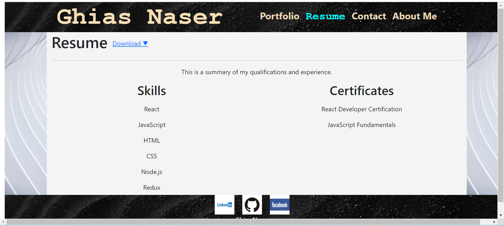
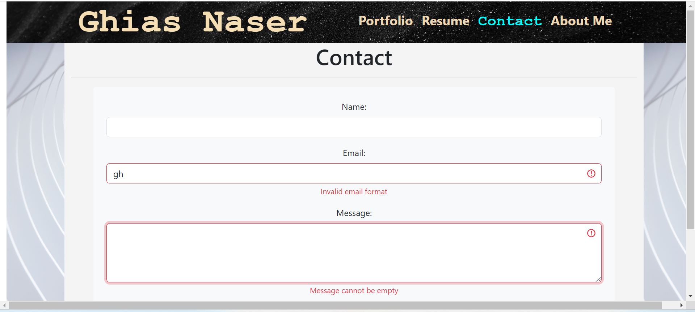
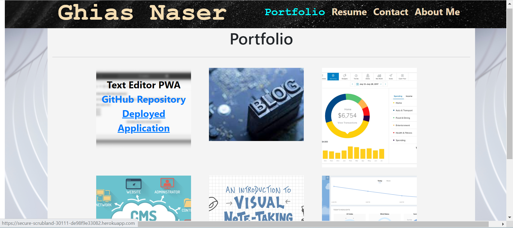

# Developer Portfolio

## Description
Create a modern and dynamic portfolio using React to effectively showcase your skills and projects. This portfolio will provide potential employers with an overview of your work samples and professional information.

## Installation

N/A

## Usage
To access the portfolio, simply click the link: https://ghiasnaser.github.io/developer_portfolio/. The default landing page is the "About Me" section. You can use the navigation bar to explore different sections:

Resume Page: This section provides a brief overview of my skills, along with the option to download my resume.

Contact Page: The contact form includes three fields: Name, Email, and Message. The email field displays an error notification until a valid email format is entered. The message field cannot be submitted empty; an alert will prompt if attempted.

Portfolio Page: This page showcases six project images. Hovering over each image reveals the project title along with two links—one to the deployed application and another to the GitHub repository.

The footer bar, consistent across all pages, displays logos for GitHub, LinkedIn, and Facebook. Clicking on these logos will direct you to my profiles on these platforms.

## Assets
The following image demonstrates the web application's appearance and functionality:

## Credits

N/A

## License

Licensed under the [MIT](https://github.com/ghiasnaser/developer_portfolio/blob/650e18279c7903ce6b4ce8b31179ec60fd6cf2a4/LICENSE) license.
## Links
The deployed application link:  https://ghiasnaser.github.io/developer_portfolio/
The repository link: https://github.com/ghiasnaser/developer_portfolio.git
